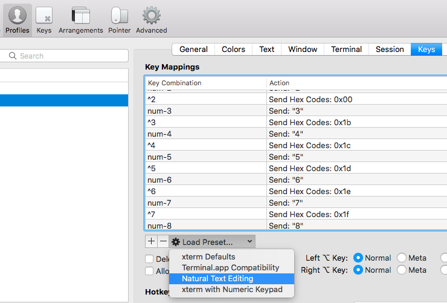

[](http://forthebadge.com)

[](http://forthebadge.com)

[](http://forthebadge.com)

# PARTY-TERMINAL
party parrot terminal config for 'oh-my-zsh'

 
 
 
 


## Update
Added a `party` function in the zshcfg to allow for turning the parrots on or off.

```bash
# turn off party parrots
> party -n

# turn on party parrots
> party -y
# or
> party
```


# Dependencies

- **[iterm2](https://iterm2.com/documentation-images.html)**
- **[oh-my-zsh](http://ohmyz.sh/)**
- **[powerlevel9k](https://github.com/Powerlevel9k/powerlevel9k/wiki/Install-Instructions#option-2-install-for-oh-my-zsh)**
- **[imgcat](https://iterm2.com/documentation-images.html)** `for party img display | Iterm2 > Install Shell Integration`
- **[zsh-syntax-highlighting](https://github.com/zsh-users/zsh-syntax-highlighting/blob/master/INSTALL.md#oh-my-zsh)** need to clone into plugins folder
- **[apixu - for weather](https://www.apixu.com/)** *signup is FREE* <br>
    modify the line <br>`local weather=$(curl -s "http://api.apixu.com/v1/current.json?key=<your-api-key>&q=<zip-code>")`<br> in .zshrc
- **jq**
    `brew install jq`
- **gshuf**
    `brew install coreutils`
- **airport** `# create symlink (below)`
```bash
sudo ln -s /System/Library/PrivateFrameworks/Apple80211.framework/Versions/Current/Resources/airport /usr/local/bin/airport
```

# Optional Config
**You may need to adjust the .zshrc file if not using the following**

- **MODIFY .ZSHRC**
    ```bash
    prompt_zsh_party(){
        local fname=$(ls '/Users/PUF1501/temp/termicon/parrots' | gshuf -n 1)
        local img=$(imgcat '/Users/PUF1501/temp/termicon/parrots/'$fname)
        echo -n $img'\n'
    }
    ```
        with the '/path/to/parrots/folder'

- **[diff-so-fancy](https://github.com/so-fancy/diff-so-fancy)**
    ```bash
    # First, add the diff-so-fancy script to your PATH - (see /scripts/)
    # Then => execute:
    git config --global alias.dsf '!f() { [ -z "$GIT_PREFIX" ] || cd "$GIT_PREFIX" '\
    '&& git diff --color "$@" | diff-so-fancy  | less --tabs=4 -RFX; }; f'
    # Or check out the Repo for more usage instructions
    ```
- **[colorls](https://github.com/athityakumar/colorls)** (ruby) <br>
    `brew install ruby` <br>
    `sudo chown -R username:group ~/.gem` <br>
    `gem install colorls`

    (*nix) if you run into issues creating the makefile try `sudo apt-get install build-essential dh-autoreconf`
- Create key-mapping in `Iterm2 > Preferences > Keys > Key Mappings` for ^[accept in (zsh-autosuggestion) <br><br>


- Optional wifi / battery segments (modify .zshrc)
```bash
    POWERLEVEL9K_RIGHT_PROMPT_ELEMENTS=(status zsh_weather time custom_internet_signal zsh_battery_level)
```


### FONTS
- **USE FURA CODE NERD FONT** `13.5pt` (see /font/)
- **USE LIGATURES**

# Plugins

- [zsh-syntax-highlighting](https://github.com/zsh-users/zsh-syntax-highlighting/blob/master/INSTALL.md#oh-my-zsh)
- [zsh-autosuggestions](https://github.com/zsh-users/zsh-autosuggestions)
- [osx](https://github.com/robbyrussell/oh-my-zsh/tree/master/plugins/osx)
- [emoji](https://github.com/robbyrussell/oh-my-zsh/tree/master/plugins/emoji)
- [encode64](https://github.com/robbyrussell/oh-my-zsh/blob/master/plugins/encode64/encode64.plugin.zsh)
- [sudo](https://github.com/robbyrussell/oh-my-zsh/wiki/Plugins#sudo)
- [urltools](https://github.com/robbyrussell/oh-my-zsh/wiki/Plugins#urltools)
- [web-search](https://github.com/robbyrussell/oh-my-zsh/wiki/Plugins#web-search)


# Color Scheme

## Import [iterm colors](solarized-neon.itermcolors)


# VSCode Config - see vscode folder


# Natural Text Editing

## Goto Iterm2 > Preferences > Profiles > Keys
## Select 'Load Preset' and choose 'Natural Text Editing'


