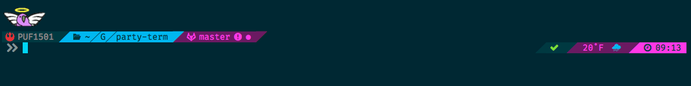
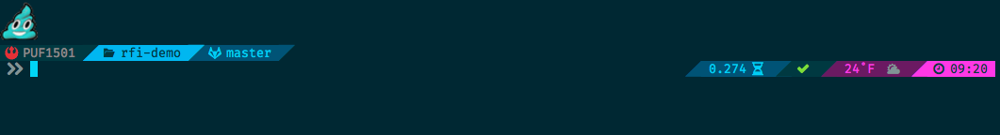
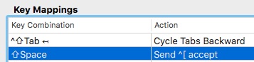
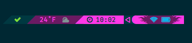
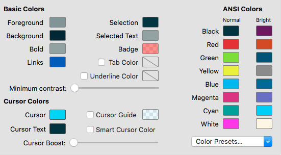

[](http://forthebadge.com)

[](http://forthebadge.com)

[](http://forthebadge.com)

# PARTY-TERMINAL
party parrot terminal config for 'oh-my-zsh'





# Dependencies

- **iterm2**
- **[oh-my-zsh](http://ohmyz.sh/)**
- **[powerlevel9k](https://github.com/bhilburn/powerlevel9k#command_execution_time)**
- **[imgcat](https://iterm2.com/documentation-images.html)** `# for party img display`
- **[apixu - for weather](https://www.apixu.com/)** *signup is FREE* <br>
    modify the line <br>`local weather=$(curl -s "http://api.apixu.com/v1/current.json?key=<your-api-key>&q=<zip-code>")`<br> in .zshrc
- **jq**        
    `brew install jq`
- **gshuf**     
    `brew install coreutils`
- **airport** `# create symlink (below)`
```bash
sudo ln -s /System/Library/PrivateFrameworks/Apple80211.framework/Versions/Current/Resources/airport /usr/sbin/airport
```

# Not Necessarily Required
**You may need to adjust the .zshrc file if not using the following**

- **MODIFY .ZSHRC**
    ```bash
    prompt_zsh_party(){
        local fname=$(ls '/Users/PUF1501/temp/termicon/parrots' | gshuf -n 1)
        local img=$(imgcat '/Users/PUF1501/temp/termicon/parrots/'$fname)
        echo -n $img'\n'
    }
    ```
        with the '/path/to/parrots/folder'

- **[chrome shortcut script](scripts/chrome)**
- **colorls** (ruby) <br>
    `brew install ruby` <br>
    `sudo chown -R username:group ~/.gem` <br>
    `gem install colorls`
- Create key-mapping in `Iterm2 > Preferences > Keys > Key Mappings` for ^[accept in (zsh-autosuggestion) <br><br>



- Optional wifi / battery segments (modify .zshrc)
```bash
    POWERLEVEL9K_RIGHT_PROMPT_ELEMENTS=(status zsh_weather time custom_internet_signal zsh_battery_level)
```


### FONTS
- **USE FURA CODE NERD FONT** `13.5pt` (see /font/)
- **USE LIGATURES**

# Plugins

- [zsh-autosuggestions](https://github.com/zsh-users/zsh-autosuggestions)
- [zsh-syntax-highlighting](https://github.com/zsh-users/zsh-syntax-highlighting/blob/master/INSTALL.md)


# Color Scheme

## Import [iterm colors](solarized-neon.itermcolors)

